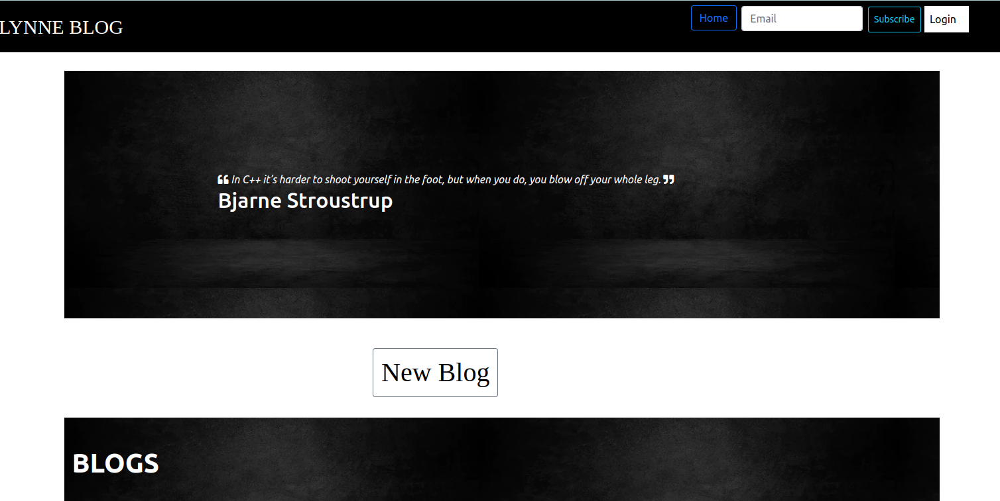

# LYNNE BLOG

#### By **{Linetlucy Genchabe}**
## Description
This is a personal blogging website where i can create and share my opinions and other users can read and comment on them.

# UI

## User Stories

* user can view the blog posts on the site
* user can comment on blog posts
* user can view the most recent posts
* user receives email alert when a new post is made by joining a subscription.
* user can see random quotes on the site
* writer can sign in to the blog.
* writer can create a blog from the application.
* writer can delete comments that I find insulting or degrading.
* writer can update or delete blogs I have created.

# BDD 
| Behaviour | Input | Output |
| :---------------- | :---------------: | ------------------: |
| Load the page | **On page load** | view quotes and all blogs, Select  signup or login|
| Select SignUp| **Email**,**Username**,**Password** | Redirect to login|
| Select Login | **Username** and **password** | Redirect to page with blogs that have been posted by writes and be able to subscribe to the blog|
| Select comment button | **Comment** | Form that you input your comment|
| Click on submit |  | Redirect to all comments tamplate with your comment and other comments|
|Subscription | **Email Address**| email message "Succesfully subsbribed to lynne Blog"|

## Setup/Installation Requirements
* git clone https://github.com/linetlucy-genchabe/lynne-blog.git
* cd lynne-blog

## Testing 
* use: python3.9 tests.py

## Known Bugs
There are no known bugs as of now.
## Technologies Used
* Python 3.9
* HTML5
* Bootstrap5
* Flask

## Support and contact details
Contact me via linetlucy21@gmail.com
### License
* MIT license
Copyright (c) {2022} **{linetlucy's BLOG}**